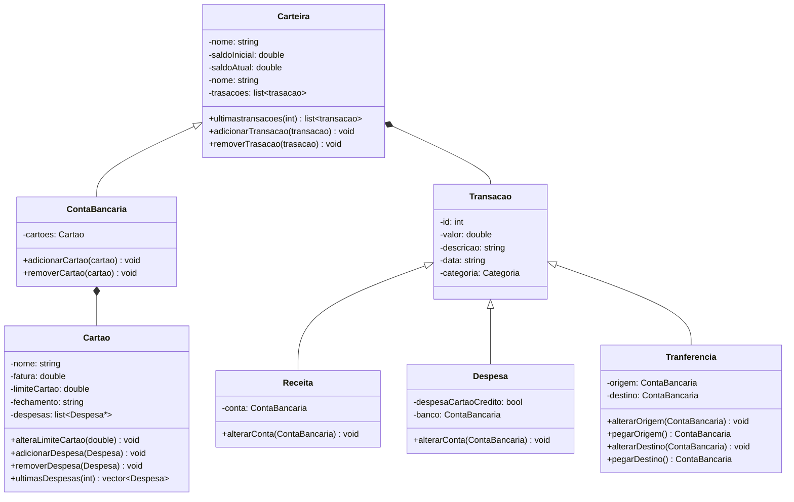

```mermaid
classDiagram

Carteira <|-- ContaBancaria

Carteira *-- Transacao
ContaBancaria *-- Cartao

class Carteira {
    -nome: string
    -saldoInicial: double
    -saldoAtual: double
    -nome: string
    -trasacoes: list~trasacao~

    +ultimastransacoes(int) list~transacao~
    +adicionarTransacao(transacao) void
    +removerTrasacao(trasacao) void
}

class ContaBancaria {
    -cartoes: Cartao

    +adicionarCartao(cartao) void
    +removerCartao(cartao) void
}

class Cartao {
    -nome: string
    -fatura: double
    -limiteCartao: double
    -fechamento: string
    -despesas: list~Despesa*~

    +alteraLimiteCartao(double) void
    +adicionarDespesa(Despesa) void
    +removerDespesa(Despesa) void
    +ultimasDespesas(int) vector~Despesa~
    
}

Transacao <|-- Receita
Transacao <|-- Despesa
Transacao <|-- Tranferencia

class Transacao {
    -id: int
    -valor: double
    -descricao: string
    -data: string
    -categoria: Categoria
}

class Receita {
    -conta: ContaBancaria 

    +alterarConta(ContaBancaria) void
}

class Despesa {
    -despesaCartaoCredito: bool
    -banco: ContaBancaria

    +alterarConta(ContaBancaria) void
}

class Tranferencia {
    -origem: ContaBancaria
    -destino: ContaBancaria

    +alterarOrigem(ContaBancaria) void
    +pegarOrigem() ContaBancaria
    +alterarDestino(ContaBancaria) void
    +pegarDestino() ContaBancaria
}
```
