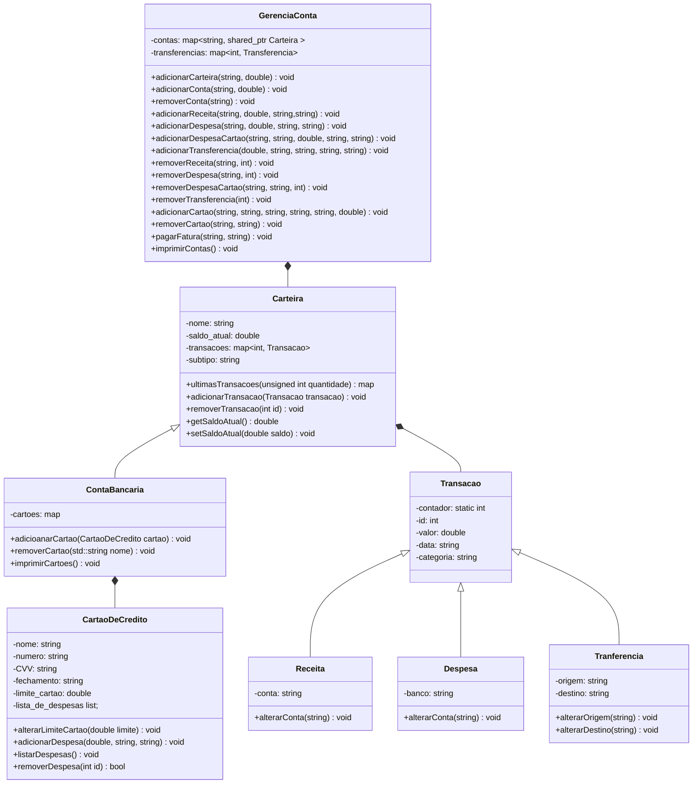

```mermaid
classDiagram

class GerenciaConta {
    -contas: map~string, shared_ptr Carteira ~
    -transferencias: map~int, Transferencia~

    +adicionarCarteira(string, double) void
    +adicionarConta(string, double) void
    +removerConta(string) void
    +adicionarReceita(string, double, string,string) void
    +adicionarDespesa(string, double, string, string) void
    +adicionarDespesaCartao(string, string, double, string, string) void
    +adicionarTransferencia(double, string, string, string, string) void
    +removerReceita(string, int) void
    +removerDespesa(string, int) void
    +removerDespesaCartao(string, string, int) void
    +removerTransferencia(int) void
    +adicionarCartao(string, string, string, string, string, double) void
    +removerCartao(string, string) void
    +pagarFatura(string, string) void
    +imprimirContas() void
}

GerenciaConta *-- Carteira
Carteira <|-- ContaBancaria

Carteira *-- Transacao
ContaBancaria *-- CartaoDeCredito

class Carteira {
    -nome: string
    -saldo_atual: double
    -transacoes: map~int, Transacao~
    -subtipo: string

    +ultimasTransacoes(unsigned int quantidade) map
    +adicionarTransacao(Transacao transacao) void
    +removerTransacao(int id) void
    +getSaldoAtual() double
    +setSaldoAtual(double saldo) void
}

class ContaBancaria {
    -cartoes: map<string, CartaoDeCredito>

    +adicioanarCartao(CartaoDeCredito cartao) void
    +removerCartao(std::string nome) void 
    +imprimirCartoes() void
}

class CartaoDeCredito {
    -nome: string
    -numero: string
    -CVV: string
    -fechamento: string
    -limite_cartao: double
    -lista_de_despesas list;

    +alterarLimiteCartao(double limite) void
    +adicionarDespesa(double, string, string) void
    +listarDespesas() void
    +removerDespesa(int id) bool
    
}

Transacao <|-- Receita
Transacao <|-- Despesa
Transacao <|-- Tranferencia

class Transacao {
    -contador: static int
    -id: int
    -valor: double
    -data: string
    -categoria: string
}

class Receita {
    -conta: string 

    +alterarConta(string) void
}

class Despesa {
    -banco: string

    +alterarConta(string) void
}

class Tranferencia {
    -origem: string
    -destino: string

    +alterarOrigem(string) void
    +alterarDestino(string) void
}

```