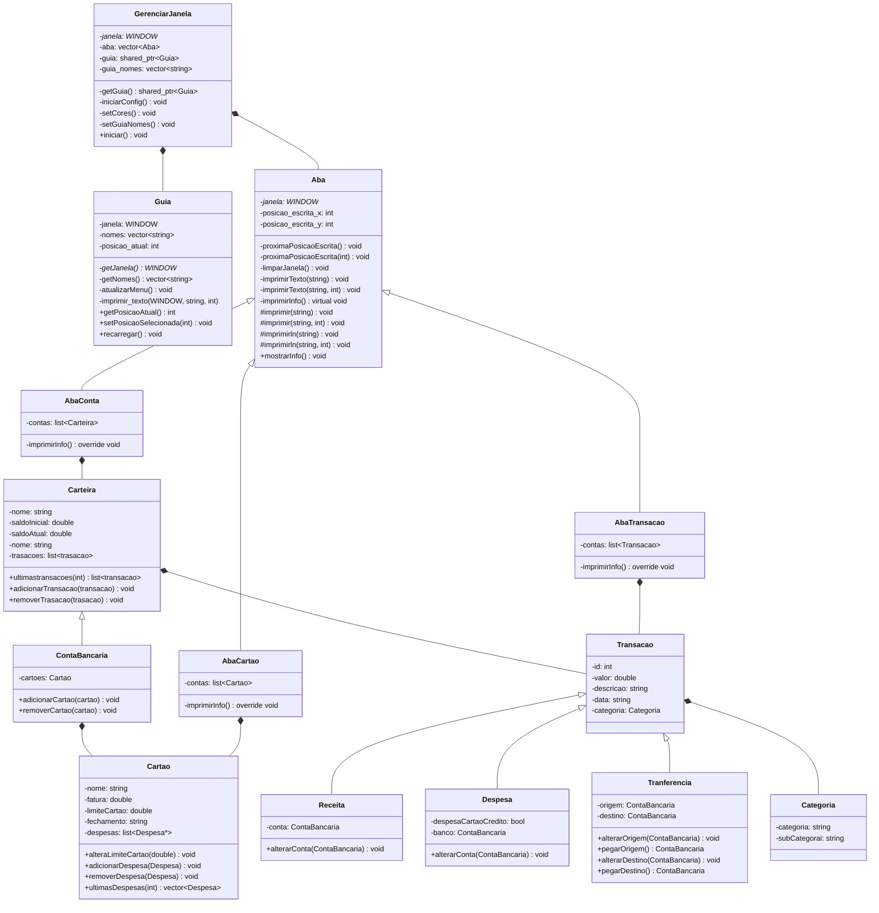

```mermaid
classDiagram

Carteira <|-- ContaBancaria

Carteira *-- Transacao
ContaBancaria *-- Cartao

class Carteira {
    -nome: string
    -saldoInicial: double
    -saldoAtual: double
    -nome: string
    -trasacoes: list~trasacao~

    +ultimastransacoes(int) list~transacao~
    +adicionarTransacao(transacao) void
    +removerTrasacao(trasacao) void
}

class ContaBancaria {
    -cartoes: Cartao

    +adicionarCartao(cartao) void
    +removerCartao(cartao) void
}

class Cartao {
    -nome: string
    -fatura: double
    -limiteCartao: double
    -fechamento: string
    -despesas: list~Despesa*~

    +alteraLimiteCartao(double) void
    +adicionarDespesa(Despesa) void
    +removerDespesa(Despesa) void
    +ultimasDespesas(int) vector~Despesa~
    
}

Transacao <|-- Receita
Transacao <|-- Despesa
Transacao <|-- Tranferencia

class Transacao {
    -id: int
    -valor: double
    -descricao: string
    -data: string
    -categoria: Categoria
}

class Receita {
    -conta: ContaBancaria 

    +alterarConta(ContaBancaria) void
}

class Despesa {
    -despesaCartaoCredito: bool
    -banco: ContaBancaria

    +alterarConta(ContaBancaria) void
}

class Tranferencia {
    -origem: ContaBancaria
    -destino: ContaBancaria

    +alterarOrigem(ContaBancaria) void
    +pegarOrigem() ContaBancaria
    +alterarDestino(ContaBancaria) void
    +pegarDestino() ContaBancaria
}

Transacao *-- Categoria

class Categoria {
    -categoria: string
    -subCategorai: string
}

class GerenciarJanela {
    -janela: WINDOW*
    -aba: vector~Aba~
    -guia: shared_ptr~Guia~
    -guia_nomes: vector~string~
    
    -getGuia() shared_ptr~Guia~
    -iniciarConfig() void
    -setCores() void
    -setGuiaNomes() void
    +iniciar() void
}

GerenciarJanela *-- Guia
GerenciarJanela *-- Aba

class Guia {
    -janela: WINDOW
    -nomes: vector~string~
    -posicao_atual: int

    -getJanela() WINDOW*
    -getNomes() vector~string~
    -atualizarMenu() void
    -imprimir_texto(WINDOW, string, int)
    +getPosicaoAtual() int
    +setPosicaoSelecionada(int) void
    +recarregar() void
}

class Aba {
    -janela: WINDOW*
    -posicao_escrita_x: int 
    -posicao_escrita_y: int

    -proximaPosicaoEscrita() void
    -proximaPosicaoEscrita(int) void
    -limparJanela() void
    -imprimirTexto(string) void
    -imprimirTexto(string, int) void
    -imprimirInfo() virtual void
    #imprimir(string) void
    #imprimir(string, int) void
    #imprimirln(string) void
    #imprimirln(string, int) void
    +mostrarInfo() void
}

Aba <|-- AbaConta
Aba <|-- AbaCartao
Aba <|-- AbaTransacao

class AbaConta {
    -contas: list~Carteira~
    
    -imprimirInfo() override void
}

class AbaCartao {
    -contas: list~Cartao~
    
    -imprimirInfo() override void
}

class AbaTransacao {
    -contas: list~Transacao~
    
    -imprimirInfo() override void
}

AbaConta *-- Carteira
AbaCartao *-- Cartao
AbaTransacao *-- Transacao

```